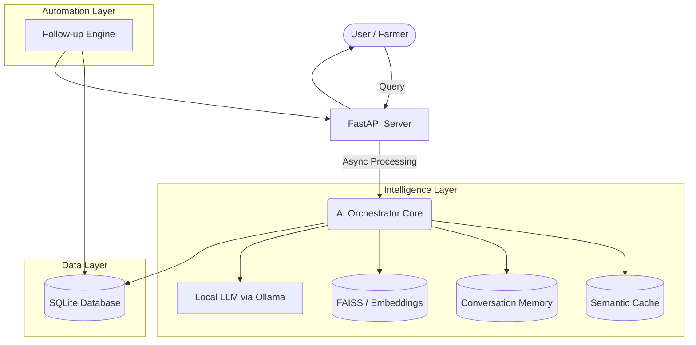

# 🌱 AgriMind Orchestrator  
### AI-Powered Agricultural Intelligence & Automation System

An intelligent, modular AI orchestration system designed to assist farmers, agri-businesses, and stakeholders through real-time insights, automated decision-making, and conversational interfaces.

Built with a local-first AI architecture, AgriMind ensures data privacy, low operational cost, and scalable deployment in rural environments.

---

## 🧠 What This Project Solves

Agriculture suffers from:
- Lack of real-time advisory
- Fragmented data sources
- Limited access to expert guidance
- High dependency on manual decision-making

AgriMind Orchestrator bridges this gap by combining:
- Conversational AI  
- Local LLM inference  
- Intelligent data retrieval  
- Automated follow-ups & insights  

---

## 🏗️ System Architecture



---

## ✨ Key Features

### 🧠 Local AI Inference (Zero API Dependency)
- Runs fully on local LLMs (Qwen / LLaMA via Ollama)
- No external API calls → 100% data privacy
- Works in low-connectivity rural setups

### ⚡ Semantic Intelligence Layer
- Uses Sentence Transformers for embeddings  
- Detects similar queries via cosine similarity  
- Returns cached responses instantly  

Impact:
- Response time: ~4s → <100ms
- Reduced compute cost
- Scalable query handling

### 🧵 Stateful Conversation Engine
- Maintains multi-turn context
- Stores interaction history in SQLite
- Enables personalized responses  

### 📊 Lead & Insight Extraction
- Extracts Name, Contact, Interest
- Converts conversations into structured data

### ⏰ Automated Follow-Up System
- Detects inactive users
- Sends intelligent reminders

### 🚀 Async Event-Driven Backend
- Built with FastAPI + asyncio
- Handles high concurrency efficiently

---

## 🛡️ Tech Stack

| Layer | Technology | Purpose |
|------|-----------|--------|
| Backend | FastAPI, Uvicorn | Async API & webhook handling |
| AI Engine | Ollama | Local LLM execution |
| Embeddings | Sentence-Transformers | Semantic search |
| Vector DB | FAISS | Similarity search |
| Database | SQLite | Storage |
| Automation | Python Async Workers | Background jobs |
| Deployment | Docker | Containerization |

---

## 🛠️ Setup Guide

### 1. Prerequisites
- Python 3.10+
- Ollama installed

```bash
ollama pull qwen2.5:14b-instruct
```

### 2. Clone Repository

```bash
git clone https://github.com/itsmeakshay0510/Agri-mind-orchestrator.git
cd Agri-mind-orchestrator
```

### 3. Setup Environment

```bash
python -m venv venv
.\venv\Scripts\activate
pip install -r requirements.txt
```

### 4. Configure .env

```
WHATSAPP_VERIFY_TOKEN=your_token
WHATSAPP_ACCESS_TOKEN=your_access_token
WHATSAPP_PHONE_NUMBER_ID=your_id
```

### 5. Run

```bash
python main.py
```

---

## 📈 Why This Project Stands Out

- Fully local AI system  
- Production-level architecture  
- Real-world AgriTech use case  
- Cost-efficient and scalable  

---

## 📌 Author

Akshay Raj  
AI Engineer | Backend Systems | Applied ML
